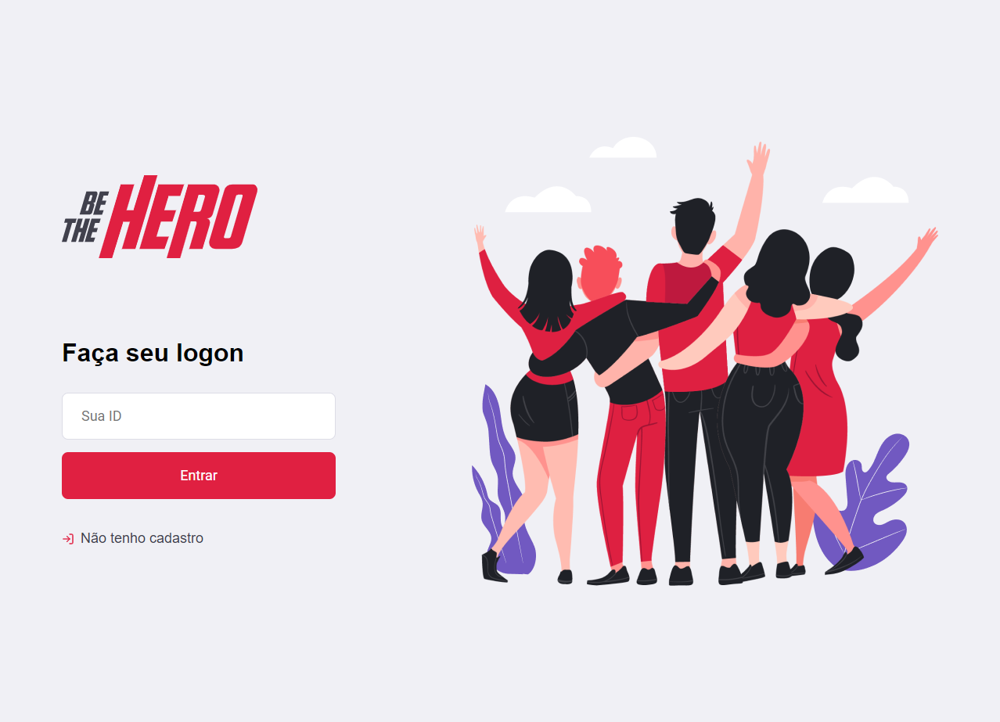

# Be The hero

This project was developed in my quaretine during the [Week Omnistak by RocketSeat](https://rocketseat.com.br/week/aulas/11.0).

### Tech

In this project we used:

* NodeJS - Backend
* React - Frontend
* React-Native (Expo) - Mobile
* Sqlite - Database
* Jest - Unit and Integration tests
